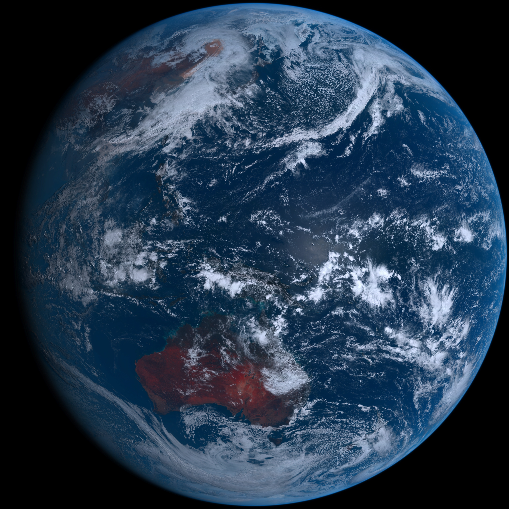

# ps1

- ### [BingWallpaper](https://github.com/milankomaj/ps1/wiki/BingWallpaper)  
- ##### Saturday 17/02/2024 03:08:22 +00

Whitby Abbey, North Yorkshire, England (© Kev Hill/Moment/Getty Images)

- ### [Himawari](https://github.com/milankomaj/ps1/wiki/Himawari)  
- ##### Saturday 17/02/2024 03:08:56 +00
 

---

* [:link: wiki](https://github.com/milankomaj/ps1/wiki)

